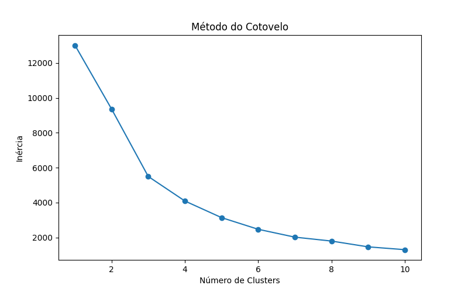
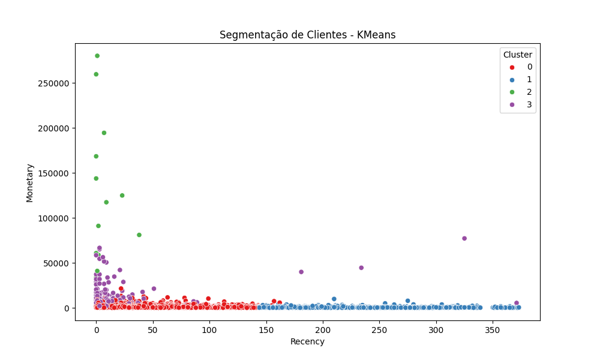

# Segmentação de Clientes com RFM e K-Means

Este projeto aplica técnicas de *análise de dados e machine learning não supervisionado* para segmentar clientes com base em seu comportamento de compra utilizando o modelo *RFM (Recency, Frequency, Monetary)* e o algoritmo *K-Means*.

O objetivo é identificar diferentes perfis de clientes e gerar insights que podem apoiar estratégias de *marketing, retenção e fidelização*.

---

# Objetivo do Projeto

Segmentar clientes com base em:

- *Recency* → tempo desde a última compra
- *Frequency* → quantidade de compras realizadas
- *Monetary* → valor total gasto pelo cliente

A segmentação permite identificar diferentes tipos de consumidores e direcionar estratégias específicas para cada grupo.

---

# Dataset

O dataset utilizado contém transações de um e-commerce e inclui informações como:

- número da fatura
- produto comprado
- quantidade
- preço unitário
- data da compra
- identificador do cliente
- país

Cada linha representa uma *transação individual*.

---

# Tecnologias Utilizadas

- Python
- Pandas
- NumPy
- Matplotlib
- Seaborn
- Scikit-learn

# Estrutura do Projeto

segmentacao-clientes-rfm
│
├── data
│   ├── raw
│   │
│   └── processed
│       ├── base_tratada.csv
│       ├── rfm_clientes.csv
│       └── clientes_segmentados.csv
│
├── notebooks
│   ├── EDA_Clientes.ipynb
│   ├── Feature_Engineering_RFM.ipynb
│   └── Modelagem_KMeans.ipynb
│
├── imagens
│   ├── distribuicao_compras.png
│   ├── metodo_cotovelo.png
│   └── segmentacao_kmeans.png
│
├── README.md
└── requirements.txt

---

# Etapas do Projeto

## 1. Análise Exploratória de Dados (EDA)

Nesta etapa foram realizadas:

- análise da estrutura dos dados
- tratamento de valores nulos
- remoção de devoluções (valores negativos)
- criação da variável *TotalPrice*
- análise da distribuição de compras

A distribuição das compras apresentou forte *assimetria à direita*, indicando que a maioria das compras possui valores baixos, enquanto poucas compras possuem valores muito elevados.

---

## 2. Feature Engineering – RFM

A análise RFM foi construída agregando as transações por cliente.

As métricas foram definidas como:

*Recency*

Número de dias desde a última compra do cliente.

*Frequency*

Quantidade de compras realizadas.

*Monetary*

Valor total gasto pelo cliente.

Exemplo de estrutura da base RFM:

| CustomerID | Recency | Frequency | Monetary |
|---|---|---|---|
12345 | 10 | 15 | 3500 |

---

## 3. Padronização dos Dados

Antes da aplicação do algoritmo de clusterização, os dados foram padronizados utilizando *StandardScaler*, garantindo que todas as variáveis possuam a mesma escala.

---

## 4. Determinação do Número de Clusters

Para definir o número ideal de clusters foi utilizado o *Método do Cotovelo (Elbow Method)*.

O gráfico indica que *4 clusters* é um ponto adequado de segmentação.

---

## 5. Segmentação com K-Means

O algoritmo *K-Means* foi aplicado para agrupar clientes com comportamentos semelhantes.

Cada cliente foi atribuído a um cluster com base nas variáveis:

- Recency
- Frequency
- Monetary

---

## Visualização dos Clusters

A segmentação pode ser visualizada no gráfico abaixo.

Cada ponto representa um cliente e as cores representam os clusters identificados pelo algoritmo.

---

# Interpretação dos Clusters

A análise dos clusters permite identificar diferentes perfis de clientes.

A interpretação dos clusters foi realizada analisando as médias das variáveis
Recency, Frequency e Monetary em cada grupo.

Com base nessa análise, foram identificados perfis como:

* Clientes de alto valor (alta frequência e alto gasto)

* Clientes inativos (alto tempo desde a última compra)

* Clientes ocasionais (baixa frequência de compra)

* Clientes recentes (compras recentes com potencial de crescimento)

---

# Insights de Negócio

A segmentação permite direcionar estratégias como:

*Clientes VIP*

- programas de fidelidade
- ofertas exclusivas

*Clientes Inativos*

- campanhas de reativação
- cupons de desconto

*Clientes Ocasionais*

- incentivos para aumentar frequência

*Clientes Recentes*

- estratégias de retenção inicial

---

# 👨‍💻 Autor

Murillo Bernardes

- Jupyter Notebook

---
